# CodeSonia Portfolio

## Code Institute Milestone Project: User-Centric Frontend Development


Welcome to my portfolio website. CodeSonia is myself and a brand that I have built for this project. You will find a fun, interactive website that showcases my skills, work history and recent projects. 

A live website can be found [here](https://codesonia.github.io/CodeSonia_Personal_Portfolio/)


Take a read below, and see why I have chosen to put in place certain features. 

[Back To Top](#codesonia-portfolio)

# Table of Contents
- [UX](#ux)
  * [Strategy](#strategy)
    + [Project goal: To get noticed](#project-goal--to-get-noticed)
      - [User Goals:](#user-goals)
      - [User Values:](#user-values)
      - [User Expectations:](#user-expectations)
      - [User Stories:](#user-stories)
      - [Strategy Table](#strategy-table)
      - [Trends of modern websites:](#trends-of-modern-websites)
  * [Scope](#scope)
  * [Structure](#structure)
  * [Skeleton](#skeleton)
      - [Mobile Wireframe:](#mobile)
      - [Tablet Wireframe:](#tablet)
      - [Desktop Wireframe:](#desktop)
  * [Surface](#surface)
- [Features](#features)
    + [Existing Features](#existing-features)
    + [Features Left to Implement](#features-left-to-implement)
- [Technologies Used](#technologies-used)
- [Testing](#testing)
- [Deployment](#deployment)
- [Credits](#credits)
# UX

Before writing any code, I did some user research. I used Jesse James Garett's user-centred Design process to ensure my website is useful, usable and provides value to both targeted users and myself as the product owner. 

Throughout the development of CodeSonia I ensured that I kept the user in mind and ensuring the website is:

- Useful: useful to the user who wants to interact with your product.
- Useable: when interacting with your product, it is also an enjoyable experience - it generates a positive emotional response.
- Valuable: valuable to the user and the product owner. 

[Back To Table of Contents](#table-of-contents)

[Back To Top](#CodeSonia)

## Strategy
### Project goal: To get noticed 


The main goal for the website is to get noticed from its targeted users. Its users are recruiters (including tech & internal), developers, designers and start-ups.

I approached my colleague, who is a tech recruiter to identify what are his expectations when viewing a dev's portfolio. 

>"I suppose 3 things really. UI does it look good initially, UX is it easy to navigate around and look through the various projects and finally the code behind it. Are there links from the projects that lead to the source code, either on GitHub or similar etc so that our clients can assess both sides of the product. In terms of specifics, that is more or less where our expertise ends and goes over to the clients."

This has led me to identify the goals and helped guide my project below.

[Back To UX](#UX)

[Back To Table of Contents](#table-of-contents)

#### User Values:
1. Help users achieve their goals
  - Learn about CodeSonia
2. Help advance CodeSonia's (product owner) goals

[Back To UX](#UX)

[Back To Table of Contents](#table-of-contents)

#### User Goals:
- Recruiters would want to hire the applicant or provide job opportunities.
- Designers or developers would want to get in touch with me for collaboration on a project.
- Start-ups are growing so they would be looking to find someone who can help raise their business by building an app or website. 
- The project will assist on creating a valued perspective on me and my work, which could then lead to hirings of projects or roles 

Users should have the ability to reach out to me, provided the contact information is correct. They should find the website easy to navigate and allow them to gain knowledge about me as a potential employee. They should be able to see my skills, previous work experience and competencies. I would also want them to access recent work/projects that I have been working on to showcase that I can code using different languages. 

To achieve this goal and to stand out amongst other developers, the online website will be more than a CV. As when the user is introduced to the site it should elicit a positive emotional response. This means finding the site intuitive, enjoyable and straightforward. Rather than telling prospective employers about CodeSonia's skills, CodeSonia bridges the knowledge gap by providing case examples of completed projects to showcase CodeSonia's skills.

As well as this, my goal is to use the portfolio website to build a personal brand. But, as I have no commercial experience, this is not an essential priority. As I evolve and gain industry experience, I will be able to showcase my personality.

[Back To UX](#UX)

[Back To Table of Contents](#table-of-contents)

#### User Expectations:
The content should give me the necessary information about who is CodeSonia.
- Can I contact Sonia?
- Can I access personal details, work history and skillset? This is so I can assess if CodeSonia is the right fit for me.
- The user interface is easy to navigate.
- Can I access the website on mobile, and is it responsive?
- I want to be able to view her previous projects and work.

### User Stories:

As a product owner...
- I want to humanise my brand and showcase who CodeSonia is by providing an image, contact information, and a story to increase CodeSonia’s brand awareness.
- I want to illustrate my projects so that I can appeal to prospective recruiters/employers.
- I want to provide the ability for users to contact me with any requests, or with the ability to book a friendly conversation for networking purposes.
- I want to provide my social media channels, to personify CodeSonia.
- I want to showcase CodeSonia in her best light by providing her most significant achievements to convey the message that CodeSonia is motivated, passionate and driven in any work setting.
- I want to illustrate CodeSonia’s technical skills in a visual format so that employers/recruiters gain a better understanding of the skillset.
- I want to illustrate other skills in a fun, engaging format so that users can see that CodeSonia has soft skills that are also required for the roles they are advertising.
- I want to showcase CodeSonia’s work history so that employers can gain a better understanding of the experience learned.
- I want to showcase CodeSonia’s educational background to illustrate the different qualifications have been achieved.
- I want users to have positive, enjoyable user experience with CodeSonia’s so that they can come back to the site, contact the user with prospective job opportunities. 
- I want to provide a downloadable format of the CV so that users can have access to a traditional form of CV besides a portfolio.
- I want developers or start-ups to feel that they can quickly request to collaborate on a project.
- I want to showcase CodeSonia in her best light and that she is passionate about things within the tech industry, or females trying to get into tech - thought leadership exercise.
- I want users to quickly identify what page of the website they are on and can easily navigate from one section to another section without any hassle = ensure positive user journey at all touchpoints!

As a recruiter...
- I want to learn about the developer and who this person is beside the technical skills and view if they also have the right soft skills to assess if they can fit within the team.
- I want to be able to contact the developer to discuss potential opportunities at hand and build a great rapport as developing relationships with developers are essential. 
- I want the website to provide easy access to contact information, telephone number, email, social media links and a google map link so I am able to ascertain where the developer is based and can quickly contact them with exciting opportunities at hand.
- I want to be able to book some time with the developer on their website so that I can avoid time hassle.
- I want to be able to connect the developer using LinkedIn or professional social media channels to keep up to date with the developer’s work history or any changes.
- I expect to be able to quickly get in contact via an easy to use the contact form so that I can build a relationship or present any job opportunities at hand.
- Having access to CodeSonia’s background and work history provides them with a brief overview of CodeSonia’s competencies, technical & soft skills.
- I want to view the developer’s educational background to see how they got into software development/coding.
- If accessing the developer’s site on mobile or tablet, I expect the website to be mobile friendly and can adhere to different devices so that I can easily navigate on smaller devices.
- I want to see a word or pdf format of the CV so that I can assess the candidate’s work history and skills to ascertain if they are the right person for the job and pass their details and link the portfolio to my clients.
- I want to find what I am looking for quickly, and I want the layout of the site to make sense, so I am not confused or put off from using it. 
- I want the information presented in a way that is intuitive, easy to navigate, so I can find out what I need effectively and efficiently.

As a collaborator...
- I want to view the developer’s project to ascertain if the developer can produce the type of things I am looking to build.
- I want to use a feature on the website to book a meeting or a phone call to ease the process of waiting for an email back or telephone call.
- For start-ups or users who are looking to hire a contractor, they would want to see a different type of content, including blogs. 
- I expect the user interface that is easy to use and not complex, where information is laid out logically so that I can easily digest the information provided.

[Back To UX](#UX)

[Back To Table of Contents](#table-of-contents)

### Strategy Table

The strategy table illustrates the trade-off between importance and viability. As we move onto Scope soon, it is clear that this project requires different phases to implement the exhaustive list of features - it is an on-going process! 

Opportunity/Problem/Feature| Importance| Viability
------------ | -------------------------|---------
About me - personal information including name, blub | 5|5
Showcase projects - link to GitHub and live site | 5 | 5
Contact me form | 5 | 5
Highlight achievements | 4 | 1
Highlight technical skills | 5 | 5
Highlight soft skills | 5 | 5
Work History| 5 | 5
Educational background| 5 | 5
Responsive Design| 5 | 5
Downloadable CV | 5 | 5
Request to collaborate | 5 | 3
Blog Section | 5 | 1
Client Testimonials | 5 | 1
Prices for services | 4 | 1
Dark mode | 4 | 1
Live chat | 4 | 1
Total| 76 | 54

### Trends of modern websites:
- Dark mode
- Large Typography - ensure many browsers and computers support the font 
- Large + Responsive hero images - strong visual experience, help tell a story as opposed to a user relying on just text.
- Harburger menus -the menu can take users directly to where they want to go, increase the conversion rate (UX movement).
- Card design - individual cards so a user can easily bite-sized pieces of content without being overwhelmed. Makes the page feeling cleaner and organised without relying on text.
- White space - minimalism design, helps users navigate around the site, from one element to another, it also creates a visual hierarchy.

[Back To UX](#UX)

[Back To Table of Contents](#table-of-contents)

## Scope

As derived from the strategy table, I am unable to put in place everything. As a result, I identified what the minimum viable product is. This means Phase 1 should be enough to satisfy users. I will then have the opportunity to get feedback for future developments.

Please find below the planned releases:

### Phase 1:
- About me
- Recent projects
- Contact me form 
- Technical Skills
- Soft Skills
- Work History
- Educational background
- Responsive design
- Dark mode

### Phase 2: 
- Multiple pages (as a I evolve as a developer, a one-page website will not suffice. As a result, linking to other pages for sections makes sense).
- Update projects (current dummy ones)
- Highlight achievements
- Blog section
- Custom URL
- Page Load feature
- Interactive elements using JS (don't have that experience yet)

### Phase 3:
- Live chat function
- Updated blog section 
- Prices for services

What is great about having an MVP and planned releases means that I can create a 'WOW' effect. As I unfold new features, it means there are new user experiences for the future. This means I will be surprising users with incremental changes that have value! 

[Back To Scope](#Scope)

[Back To Table of Contents](#table-of-contents)

## Structure

I decided to incorporate interaction design to leverage a user's prior experience:
- It is common practice for websites to have the navbar displayed horizontally. As well as this, the logo/brand of the website should be displayed on the left and lead back to the landing page. This should help navigate the user from one section to the other.
- Contact details in navbar 
- Hamburger icon for mobile design as the long navbar takes up too much real estate. 
- Social media links in the footer 
- All elements will be consistent 
- All transitions and hover effects will be consistent 
- Visual elements will be consistent, i.e. colour scheme, imagery, icons, buttons.

Information architecture refers to helping users understand their surroundings and find what they're looking for. The structure of the website allows users to know where we are. At Phase 1, a one-page scrollable feature works best. Looking at website trends also helped with this decision. A fixed navbar at the top will allow users to find their way around easily. As I evolve, as mentioned in Phase 2, I will develop multiple pages as content will become lengthier.

[Back To Structure](#structure)

[Back To Table of Contents](#table-of-contents)

## Skeleton

I used [Balsamiq](https://balsamiq.com/) to create wireframes for multiple devices. It was important at this stage to hammer down the layout and positioning of the project as informed by the above planes.

Please find below links to view the wireframes:

- [Mobile](/assets/wireframes/mobile_wireframes.pdf)
- [Tablet](/assets/wireframes/tablet_wireframes.pdf)
- [Desktop](/assets/wireframes/desktop_wireframes.pdf)

**You can also find a snapshot of the wireframes below (select each drop-down icon to view)**

## Mobile:
<details><summary></summary>


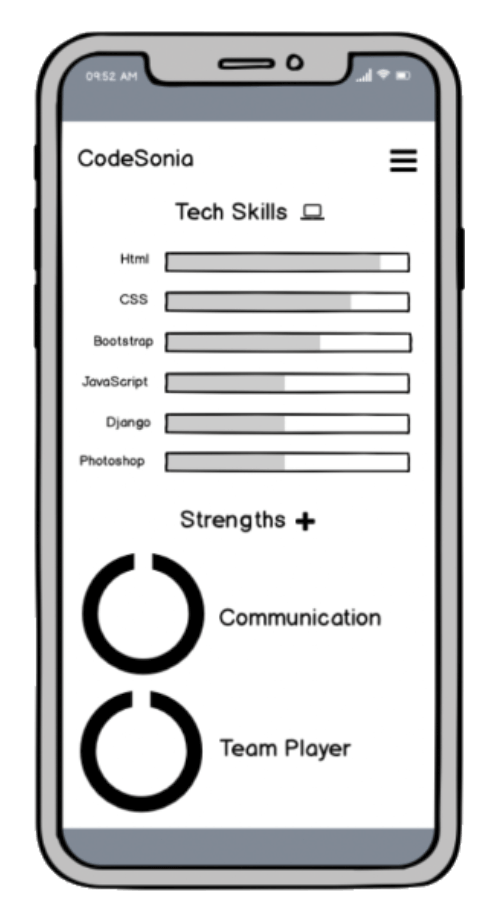

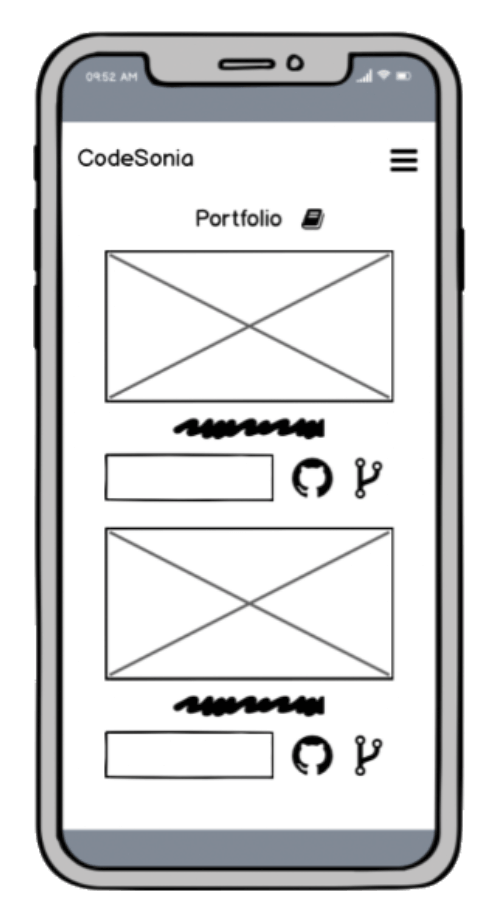


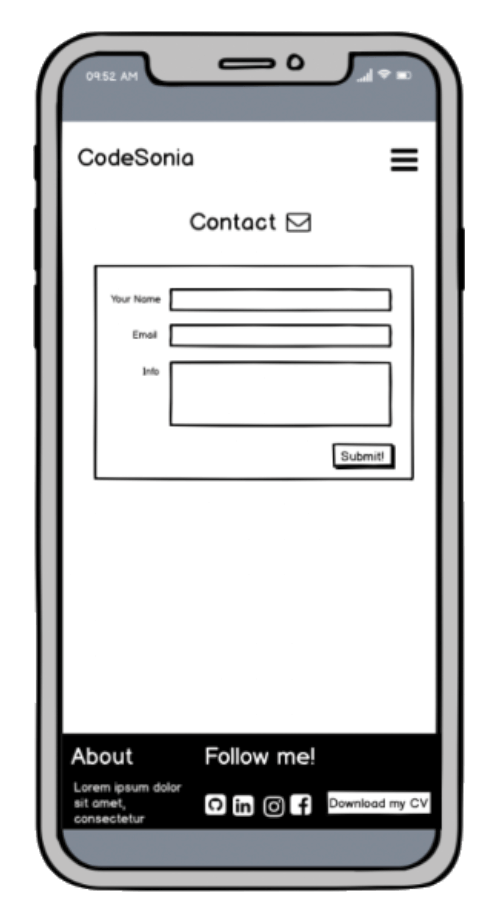

[Back To Skeleton](#Skeleton)

[Back To Table of Contents](#table-of-contents)
</details>

## Tablet:
<details><summary></summary>

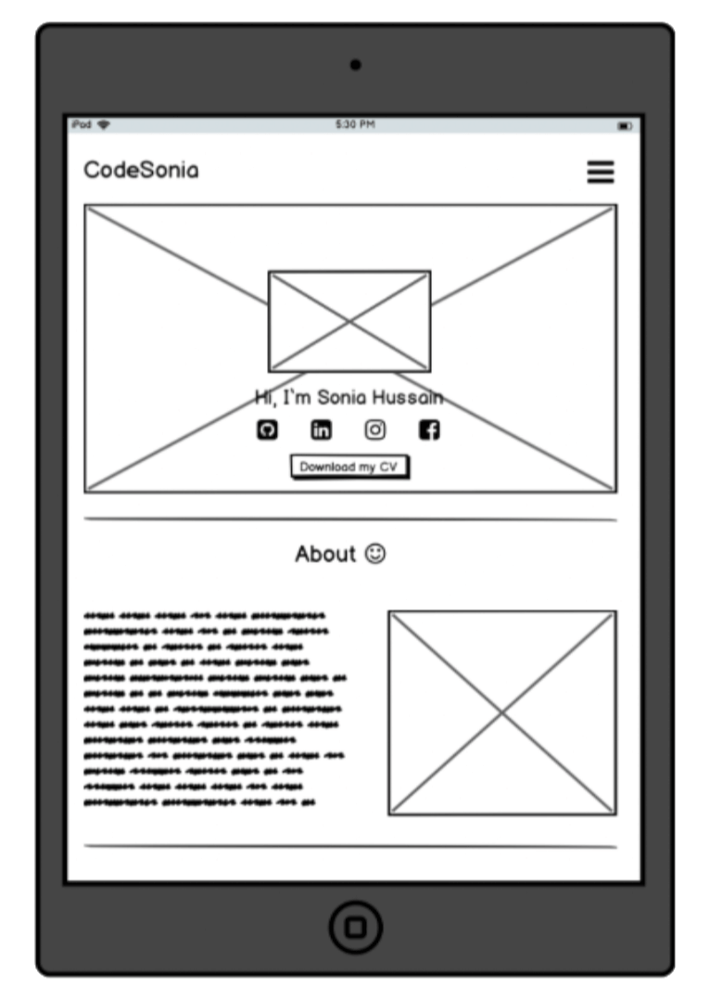

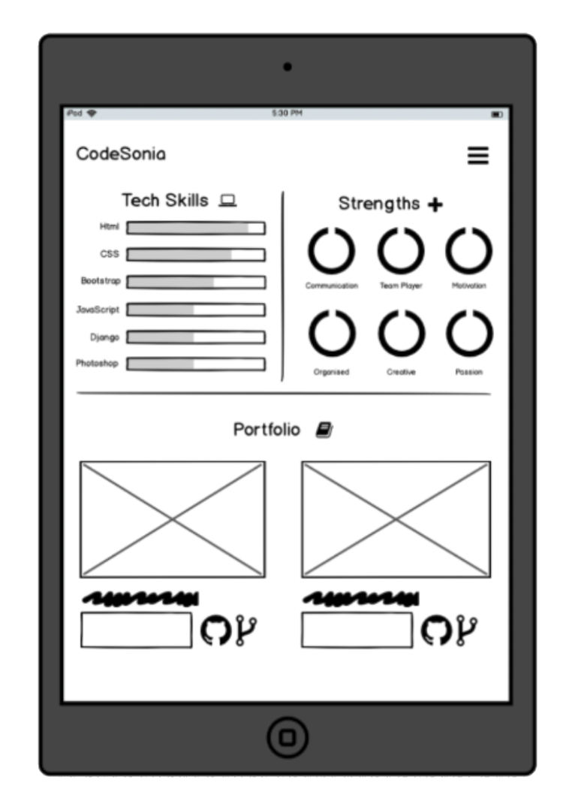

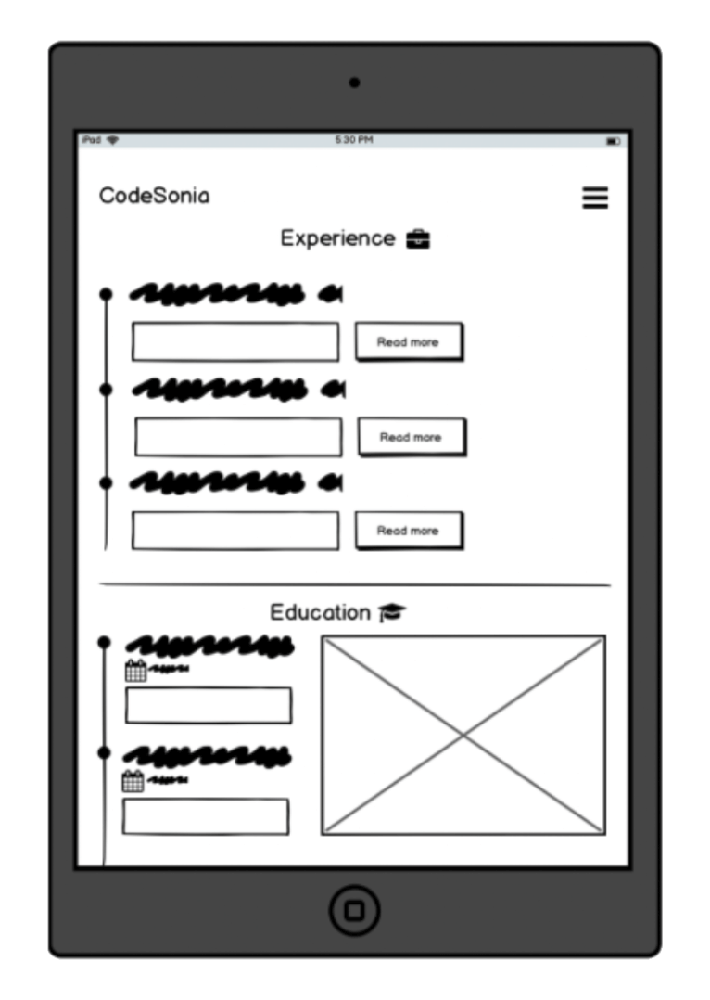

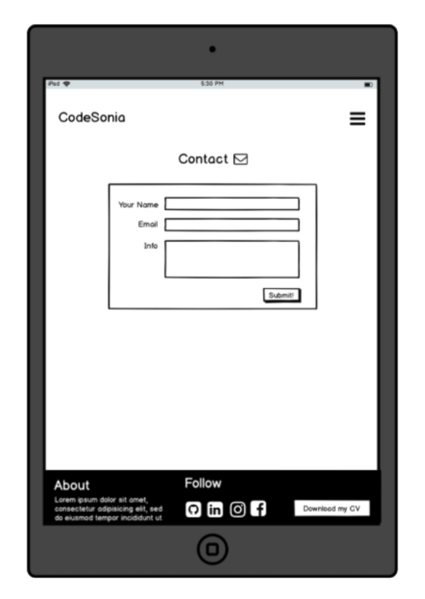

[Back To Skeleton](#Skeleton)

[Back To Table of Contents](#table-of-contents)
</details>

## Desktop:
<details><summary></summary>

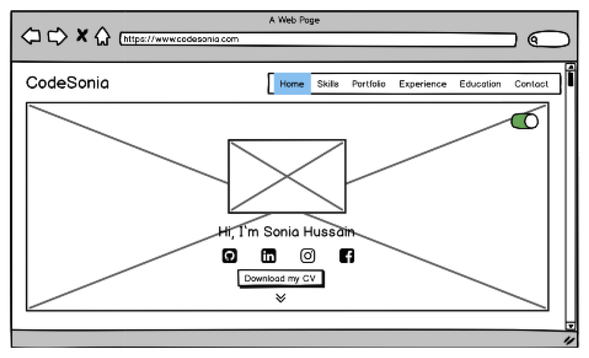

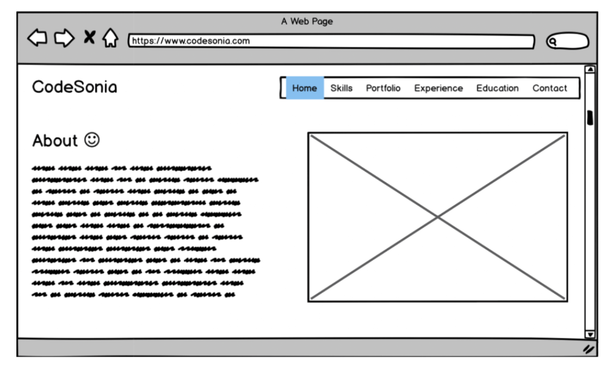

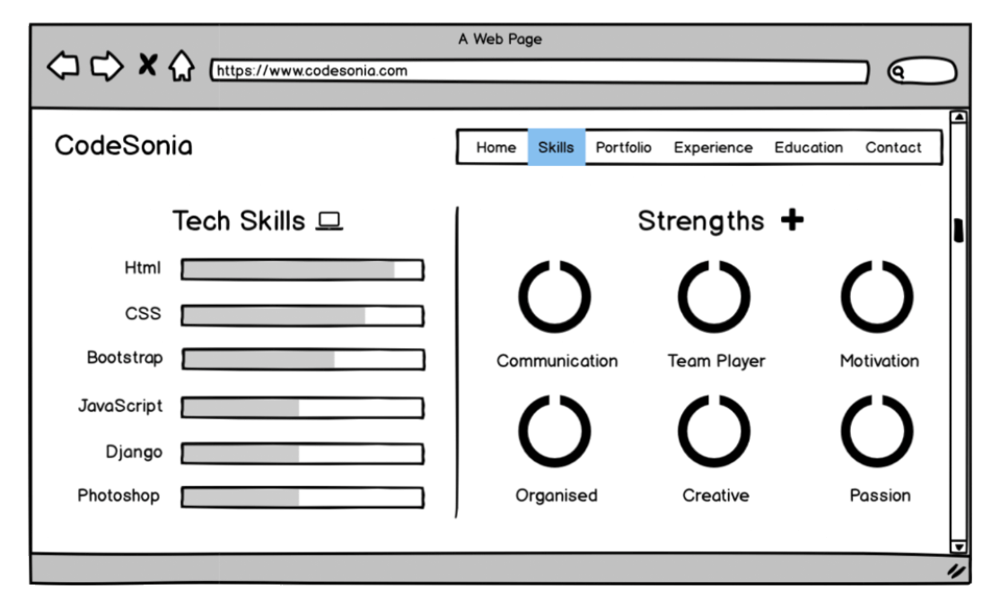

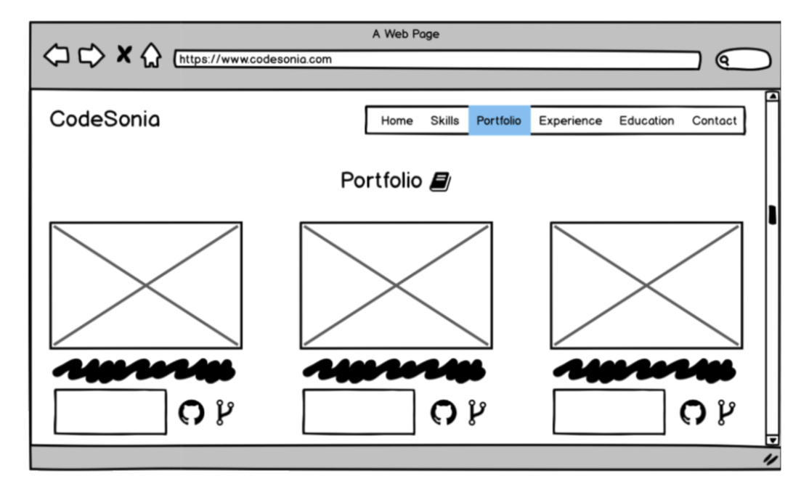

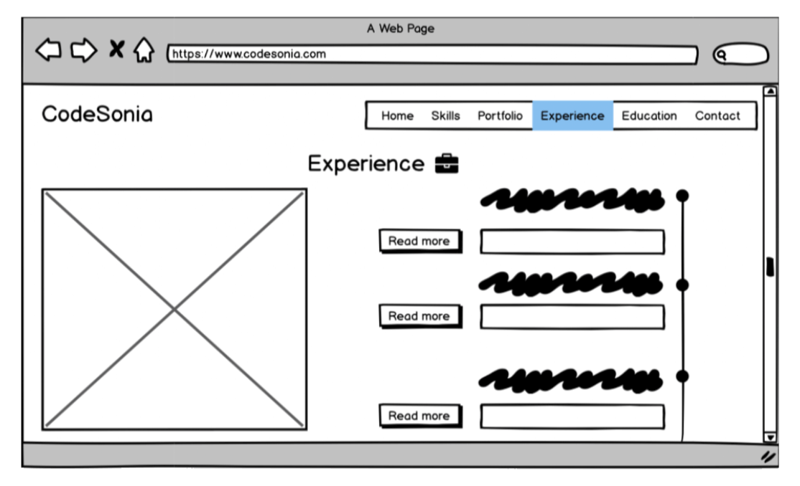

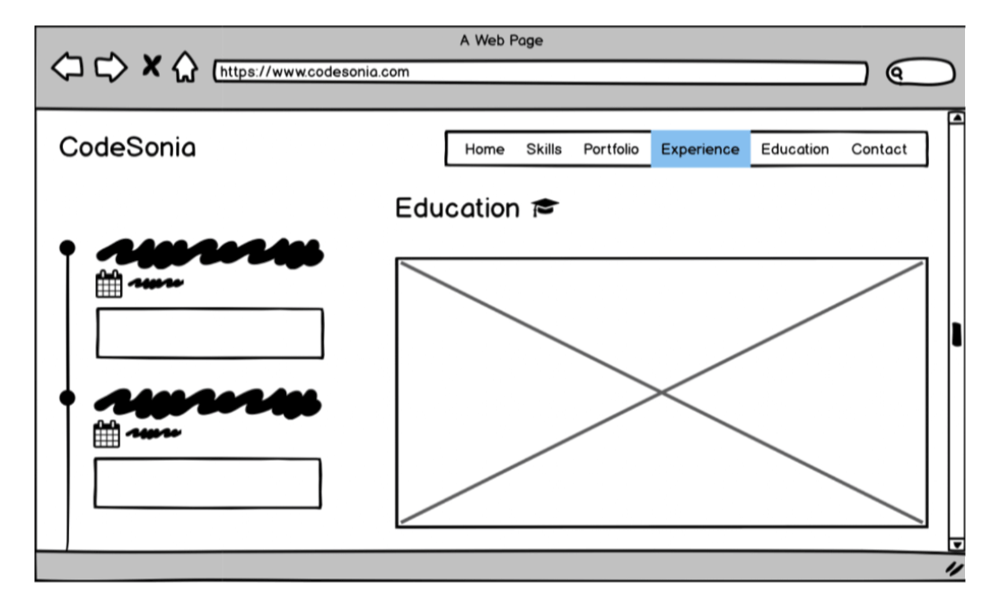

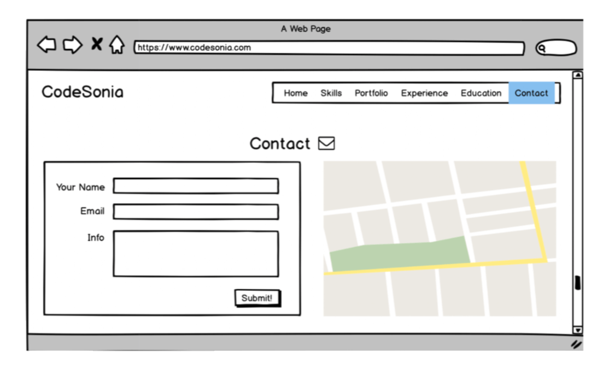

[Back To Skeleton](#Skeleton)

[Back To Table of Contents](#table-of-contents)
</details>

You will notice there are some differences to the actual website. For example, the home page no longer consists of a full size background image, instead it takes full width of a column. As you will see in my earlier commits, I did not like how the original idea turned out so I turned back to the drawing board. Which led me to utilise my design skills to create something more fun and unique. 

There are many other differences, but I believe once you try an idea out and it does not work out, there is no harm to change your idea and start thinking of new ways. 

[Back To Skeleton](#Skeleton)

[Back To Table of Contents](#table-of-contents)
## Surface 

### Colours 
Please find my colour schemes [here](colors/colour_schemes.pdf). Please also note that I did not use all colours. But, I did pick a colour and used a lighter hue. These colour schemes are intentionally picked. I was thinking what sort of message I wanted to convey on who CodeSonia is. 

#### Pink:
- Playful
- Feminine 
- Creative 

#### Purple:
- Royalty
- Nobility
- Ambition
- Creative 
- Wisdom 
- Independence 

#### Blue:
- Trust
- Loyalty
- Wisdom
- Truth 
- onfidence

### Typography
I chose to use one font and that is Roboto and used in different ways through styles and letter spacing. 

[Back To Surface](#surface)

[Back To Table of Contents](#table-of-contents)

# Features

In this section, you should go over the different parts of your project, and describe each in a sentence or so.
 
### Existing Features


#### All sections:

- Social media links - all links load onto a new tab allowing the user to be aware of where they have come from. It also has a hover effect and changes colour, further enhancing user experience. 
- Imagery - I used FreePik, Affinity Photo and Designer to create this. The vector graphics help inject emotion and humanity into the website. It also helps create a unique brand identity for CodeSonia.
Shadow - cards on about and portfolio have a shadow effect. This is to help create a 3D effect and help bring life. 
- White space - There is a lot of whitespace amongst sections. I tried to steer away from creating full-bleed imagery. Instead, I used colours to help make these sections 'pop' and stand out.
- Gradient colours - buttons and imagery have this effect adding dynamic to the site. 
- Navbar - displayed in order of priority, remains consistent and fixed to the top. This helps guide users and includes short menu titles. It collapses into a hamburger icon when viewed on smaller devices. It is also interactive and closes when a user clicks on a nav item. This helps enhance user experience. 

#### Landing page:
- Main image - a vector graphic to help draw attention to the site. It is large and portrays myself in a developer environment, making it relatable. 
- Dark mode toggle - Helps create a high contrast ratio with the use of colours and reduce any eye strain. It also helps make the site come across modern and makes the elements stand out. The toggle gives users the option to enable this. 
- Flip animation - catch the user's attention and greet them to my site. 
- Download CV - a call-to-action button that provides a link to my CV. Helps increase the potential for job opportunities, and it opens on a new browser tab. This is so that users do not forget where they came from. 
- Hire me - a button that links to the contact section encouraging users to fill the form.

#### About 
- Mobile number - uses tel: so when a user clicks on it, it brings up their dial pad. This is to help enhance the user experience and avoid dialling an incorrect number. 
- Email - uses a mailto in the href so it can easily open a user's mailbox. Again, trying to help users and be intuitive. It also allows users to quickly get in contact with me as it eases the process.

#### Skills
- Bootstrap progress bars - a visual aid so users can view how confident CodeSonia is. They also have an effect when you hover them, providing interactive features to a static page.
- Strengths - SVG circles to help build brand personality and adds character. It gives employers and recruiters a better understanding of how I may fit in their work culture. They also have a bounce hover effect of providing interactiveness. 

#### Portfolio
- Graphics - used illustrative features to inject personality. When you hover the image, they grow. 
- Shadow - the section has a shadow effect of bringing some life. 
- This section is added so that users are aware of the workflow and how I approach a project.

#### Projects 
- Bootstrap cards - To help create a visual format on past projects that I have worked on, providing a clean look.
- Imagery - Used Affinity Photo to help create mock-ups. This is, so users are encouraged to click on the links/image to see the live website.
- Links - used Font Awesome icons to help encourage users to click on them. They link to a live site and source code so that users can view the code behind the site. They also have a hover effect and can change colours. This is the same as social media icons, ensuring consistency.

#### Experience/Education
- Timeline & Bootstrap cards - Help create a visual format of this section. 
- Read more/less - I did not want to overwhelm users with a very long section. So I incorporated this feature so that users have the option to read more if they like. I also included some content before the button to entice users to learn more.

#### Contact me
- Image - I used Affinity Photo to help create my icon in work gear and format. 
- Contact form - I incorporated a simple contact form with validations. It won't let you submit if you do not have the correct email address. Also, a pink border appears when you are on a form section. I did this, so users are aware of what part they are filling. 
- Submit button - I incorporated a modal when a user submits their contact message. A modal then appears saying thanks for the message and say I will respond soon. 

### Features Left to Implement
- Calendar - a feature for the contact form. This is so that users can easily book a conversation call with me. 
- Achievements - this to showcase me in my best light. As I will gain experience, I can put this on the section to make myself more attractive to recruiters. 
- Blog section - help build brand personality and useful tips for developers. 
- Dark mode toggle button - create a 'cooler' button with a sun or moon. 
- Submit function on modal form should reset - this currently does not work.

#### General maintenance
- CodeSonia should always remain consistent, relevant and provide accurate information. For this reason, every year, the website will be updated with new information. 

[Back To Features](#features)

[Back To Table of Contents](#table-of-contents)

## Technologies Used

- [HTML](https://developer.mozilla.org/en-US/docs/Web/HTML)
  - used to structure the website and create the essential elements of my site. 
- [JQuery](https://jquery.com)
    - The project uses JQuery to simplify DOM manipulation.
- [CSS](https://www.w3.org/Style/CSS/Overview.en.html) 
  - used to style the markup and create custom styling. 
- [Bootstrap](https://getbootstrap.com/)
  - used as the core structure of the website and make my site responsive. It also includes pre-built plugins such as jQuery. 
- [JavaScript](https://developer.mozilla.org/en-US/docs/Web/JavaScript)
  - used to help create some interactive elements such as the hamburger icon, modal submit function, read more button and dark mode.
- [Hover.css](https://ianlunn.github.io/Hover/)
  - used for hover effects on buttons and images.
- [Google Developer tools](https://developers.google.com/web/tools/chrome-devtools/) 
  - to help solve a bug and help style my elements before writing code. 
- [Google Fonts](https://fonts.google.com/) 
  - used to import the font style and help create a unique brand. 
- [GitPod](https://www.gitpod.io/) 
  - used as the development environment to help write my code. 
- [Git](https://git-scm.com/) 
  - to enable version control and help commit changes to my site. 
- [GitHub](https://github.com/) 
  - used to store the source code and repository. 
- [GitHub Pages](https://pages.github.com/) 
  - used to deploy my website.
- [AutoPrefixer](https://autoprefixer.github.io/)
  - used to help parses your CSS and adds vendor prefixes
- [Balsamiq](https://balsamiq.com/) 
  - used to help create my wireframes. 
- [TinyPanda](https://tinypng.com/)
  - used to help compress the sizes of the images. 
- [FreePik](https://www.freepik.com/home) 
  - used to help provide elements for me to design my graphics (I hold a premium account).
- [Affinity Photo](https://affinity.serif.com/en-gb/photo/) 
  - used to help edit my photos and create my graphics. 
- [Affinity Designer](https://affinity.serif.com/en-gb/designer/) 
  - used to to help edit and create my graphics. 
- [Grammarly](https://app.grammarly.com/)
    - used to rectify any grammar errors. 

[Back To Technologies](#technologies)

[Back To Table of Contents](#table-of-contents)

# Testing

### Automated Testing 

#### Google Developer Tools 

I used Google Developer tools to help identify any flagged errors. A handy feature is the audit tool, and it alerted me that I had to compress my images even further. 

As well as this, the developer tool also has a responsive feature. It tells you how your site looks across multiple devices, including a 4k screen. This was insightful as I decided to use containers to ensure my site looked good on larger screens. I also made the navbar and footer to stretch across the width of the device. This is to enhance the user experience. 

Also, I found there was an issue with my portfolio and skills section when I viewed my site on mobile. I realised the shadow effect by Bootstrap was causing my section to go beyond the container. I fixed this using media queries ensuring alignment was achieved. 


#### Responsive Tools

I used [Am I Responsive](http://ami.responsivedesign.is/) and [Responsinator](https://www.responsinator.com/) to ascertain if my site is responsive on all devices. As I do not carry multiple devices, these are a handy feature to help correct any alignment or issues. 

#### W3C Validator Tools

To help validate my HTML and CSS, I used W3C validator tools to ensure my code was clean. I regularly checked if my code was cleared from any errors after each section was created. 

Here are a couple of errors flagged and rectified:
- Element `<div>` not allowed as a child of element `<button>` in this context. I rectified this by replacing `<div>` with a `<span>`and gave it a property of display:block. ```
- Image elements must have an alt attribute. I rectified this by giving an alt attribute. I realised I need to get into the habit of adding this as soon as I add an image. I understand the importance for accessibility purposes. 
- Section lacks heading. I used `<p>` tag and used Bootstrap's h4 class to style headings. I instead replaced the `<p>` and used `<h4>`. 
- Element `<span>` not allowed as child of element `<ul>` in this context - this was referring to the education and experience section. I realised I was nesting my list items incorrectly. 

## June 2021 Update:

### W3C Validator Tools

- An `img` element must have an alt attribute, except under certain conditions:
  ``

  **Solution**
  - I added the missing alt tag to help screenreaders identify what the image is and/or as a back-up solution if the image fails to load

- Bad value for attribute action on element `form`: Must be non-empty. 
  `<form action="" method="POST">`

  **Solution**
  I rectified this issue by supplying a link to where the form data can be supplied to - I used code institute form dump. For now, contact form information data does not go anywhere. It is currently static.

- Element `legend` not allowed as child element of `div` 

  **Solution** 
  I solved this by removing the div element that was originally nested inside legend. 

- The valye of the `for` attribute of the `label` element must be the ID of a non-hidden form control

  **Solution**
  I resolved this issue by replacing the `for` attribute with the correct corresponding `id`

Both my HTML & CSS passed the HTML & CSS Validation service without any further issues.

[Back To Testing](#testing)

[Back To Table of Contents](#table-of-contents)

#### Wave Report/Accessibility Testing

In order to improve my site accessibility, I ran an automated check with WAVE report. Please see the following bugs/errors I faced with and are now resolved:

1. Empty Link - a link containing no text

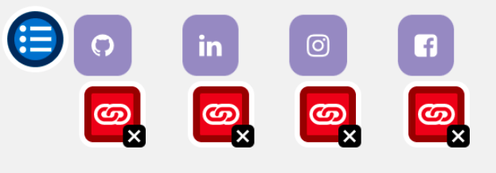

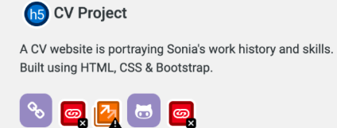

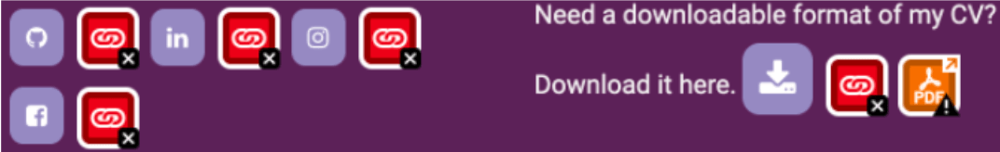


  **Solution**
  This error is important to resolve, as the function or purpose of the button will not be present to the screenreader user, therefore creating a negative experience. I updated the font awesome icons with a `aria-hidden="true">`. I then added a `<span class="sr-only">Search</span>`. This means the icons are now accessibility to screen reader users. I hid the font awesome icons so it won't be read by a screen reader.

2. Contrase Issues

Some elements of my project had a low contrast, although when I checked on Google Developer Tools, they seemed fine. However, I improved the contrast errors that were flagged on the Wave site, as I understand contrast of text is necessary for all users, especially users with low vision.

  **Solution**
  Resolved contrast errors flagged.

3. Link to PDF document 

  PDF documents generally have accessibility issues, and are typically viewed using a separate application or plug-in, and can thus cause confusion and navigation difficulties.

  **Solution** 
  I resolved this error by adding an aria-label to help identify the PDF to all users.

[Back To Testing](#testing)

[Back To Table of Contents](#table-of-contents)
### Manual Testing 

#### User Stories 
- Please view a step-by-step user stories[here](assets/testing/testing_user_stories.pdf)

I carried out manual testing on the finalised development of CodeSonia. Click [here](/assets/testing/testing.md) for a report which tested the functionality, usability and responsiveness.

I have tested my site on Safari, and Google Chrome and the website looks fine and works as intended. I have also tested on the following devices:
- iPhone X
- iPhone XR
- iPhone 6 plus
- Samsung Galaxy 
- Desktop
- Macbook Pro
- iPad 

[Back To Testing](#testing)

[Back To Table of Contents](#table-of-contents)
# Deployment

CodeSonia project was deployed to GitHub pages. In order to deploy a project onto GitHub, please view the following steps:

1. Log onto GitHub or create an account 


2. Create a repository (repo) on GitHub and name your repo with a project name and give it a description


3. Open your workspace (I use Gitpod)


4. Initialise your repo following the below commands
`git init`
- add files to Git (the staging area)
`git add .`
- We now want to write a concise commit message
`git commit -m "git init"`

5. Once your project is complete, you are now ready to deploy this onto GitHub pages.

6. Scoll onto "settings"


7. On the left-hand side, find the "Pages" tab which looks like the following:


8. Now that you are on the Pages section, select "Master Branch" under the Source headings.


9. The page will now automatically refresh. If not, give it 5 minutes. 

10. Ta-da! Your page is now live! You have now successfully deployed your GitHub repository :) 


## Running Code Locally 

To run my code locally, users can clone this by clicking on the targeted repo, click 'clone or download' and 'download zip'. Or you could paste git clone git@github.com:CodeSonia/CodeSonia_Personal_Portfolio.git into the terminal and type `git remote rm` original to remove itself from the repo.

## Forking a GitHub Repo

A "fork" enables you to generate a copy of a repo. Forking allows you to freely experiment with changes without affecting the original document. 

You can easily "fork" a project by finding the repo, and click "fork".


[Back To Deployment](#deployment)

[Back To Table of Contents](#table-of-contents)
# Credits
- Flip animation: [Nooray Yemon](https://codepen.io/yemon/pen/pWoROm)
- Animated hamburger icon: [MDBootstrap](https://mdbootstrap.com/snippets/jquery/mdbootstrap/911054)
- Clode hamburger icon once clicked: [Merangely Asensi](https://codepen.io/imprfcto/pen/WNNpBLp)
- SVG icons: [Sander](https://codepen.io/sandersu/pen/gerEbM)
- Timeline: [Bootstrapious](https://bootstrapious.com/p/timeline)
- Read more/less JavaScript: [Coding Artist](https://codingartistweb.com/2020/04/read-more-read-less/--)
- Contact modal submit JavaScript functionality: Dick Vlaanderen (my mentor)
- [Favicon](https://favicomatic.com/)
- Color choices: [Digital Synopsis](https://digitalsynopsis.com/design/beautiful-color-gradient-palettes/)
- [FreePik](https://www.freepik.com/home) (I have premium account)
- Dark mode feature: [Devloper drive](https://www.developerdrive.com/css-dark-mode/)
- [MockupWorld](https://www.mockupworld.co/)
- [StackOverflow](https://stackoverflow.com/)
- [CSS Tricks](https://css-tricks.com/fixed-headers-on-page-links-and-overlapping-content-oh-my/) help solve my navbar overlapping content by implementing `scroll-padding-top: 70px;`
- Candy Museum project thanks to [Colt Steele](https://www.udemy.com/course/the-web-developer-bootcamp/)
- CV Project, Whiskey Drop and Love Running thanks to Code Institute 

I would like to give special thanks to:

- Dick Vlaanderen - for his amazing support and guidance throughout the project.
- Lucy Rush - student care advisor for being so helpful!
- My 10-year-old cousin for letting me know she 'loves' my website and being 'wowed' for any feature implemented! 
- My partner for being supportive during the weird pandemic period and helping me when I ran into the read more button bug. 
- Last, but not least, my family for supporting me when I ran into a problem/bug. Then cheered me on for fixing it! 

[Back To Credits](#credits)

[Back To Table of Contents](#table-of-contents)

Thank you for taking the time to read my project. 

[Back To Top](#codesonia-portfolio)


